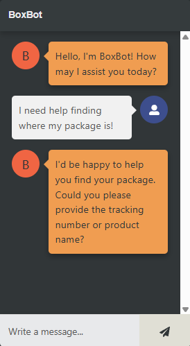
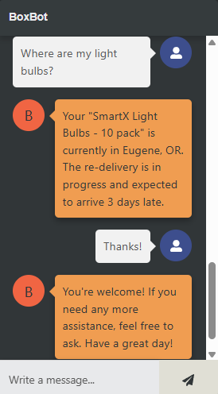
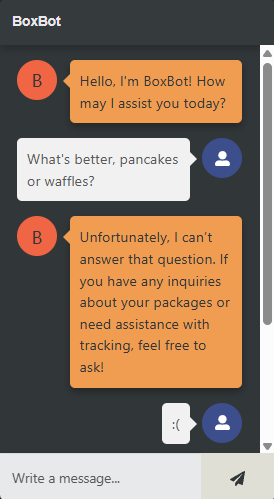

# Customer Service Chatbot

## Setup/Installation Instructions

### Prerequisites:
- Ensure you have Python installed.
- Ensure Node.js and npm are installed.

### From your terminal:
1. **Clone the repository**:
```
git clone https://github.com/owen9hall/customer-service-chatbot.git
```
2. **Backend Server Setup**:
- Enter the backend directory:
  ```
  cd customer-service-chatbot/backend
  ```
- Create and activate a virtual environment:
  - Mac/Linux:
    ```
    python3 -m venv venv
    source venv/bin/activate
    ```
  - Windows:
    ```
    python -m venv venv
    venv\Scripts\activate
    ```

- Install dependencies:
  ```
  pip install -r requirements.txt
  ```
- Start the Flask server:
  ```
  python server.py
  ```

3. **Frontend Server Setup**:
- Open a second terminal
- Navigate to the client directory:
  ```
  cd customer-service-chatbot/client
  ```
- Install packages:
  ```
  npm install
  ```
- Start the React server:
  ```
  npm start
  ```

### Notes:
- Ensure both frontend and backend servers are running simultaneously.
---

## Overview

This **customer service chatbot** application—like its name implies—is an application where the user can interact with a prototype of the customer service chatbot, **BoxBot**, designed to help locate users' packages and retrieve other package details. 

### Key Features:
- Built with a React frontend for dynamic user interaction.
- A Flask backend for handling API requests.
- A SQLite database for storing user and package data.
- OpenAI language model for intelligent BoxBot responses.

---

## Examples of BoxBot in Action:


